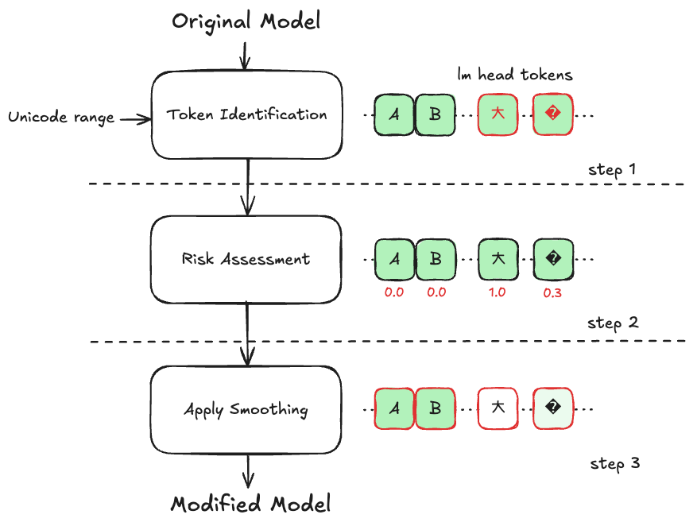
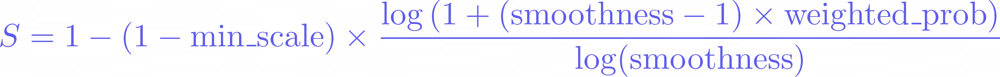
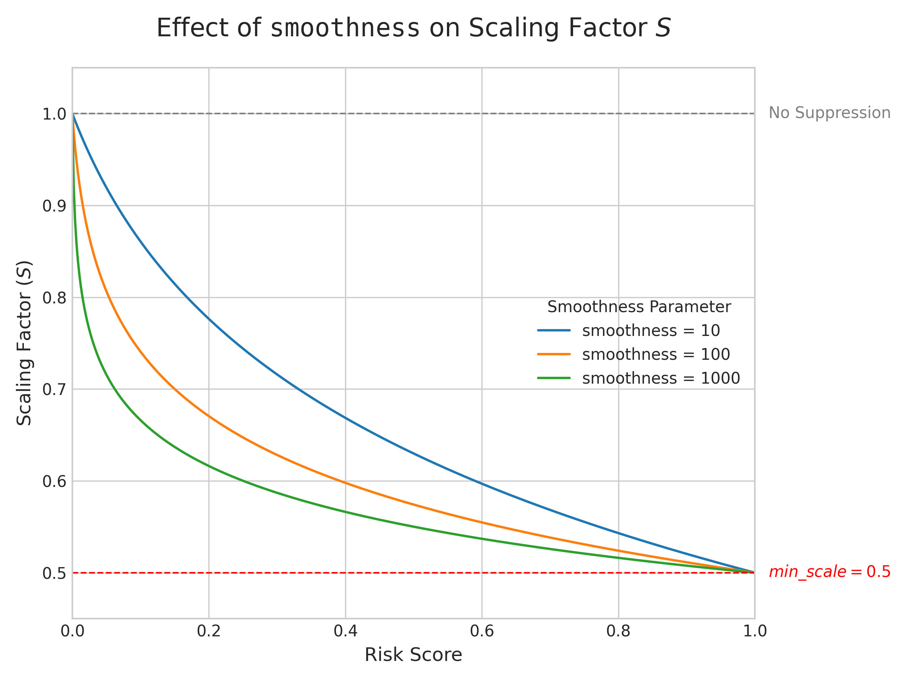
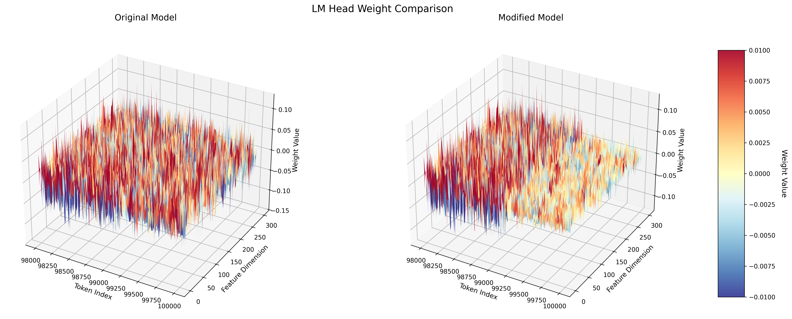
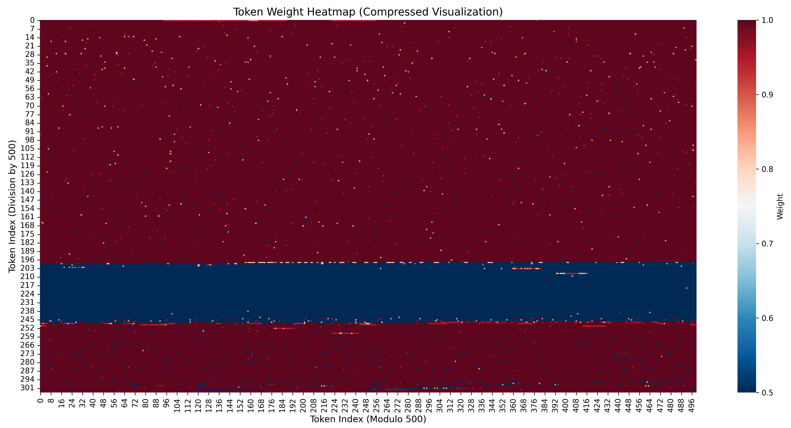
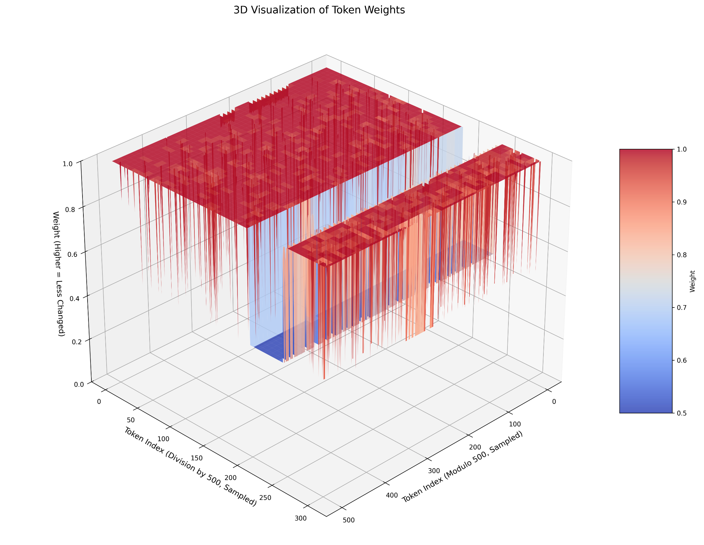
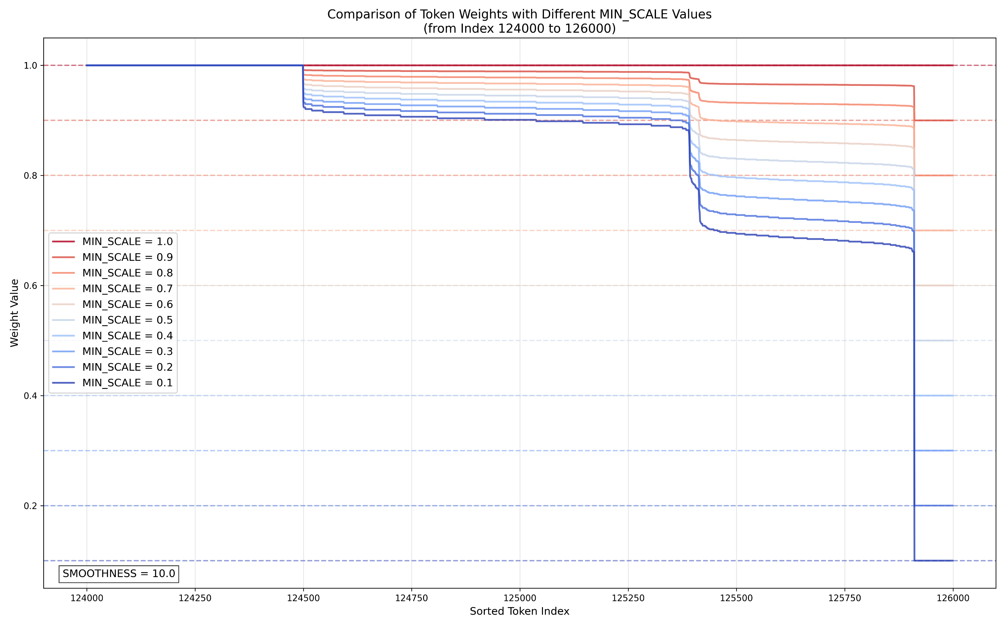
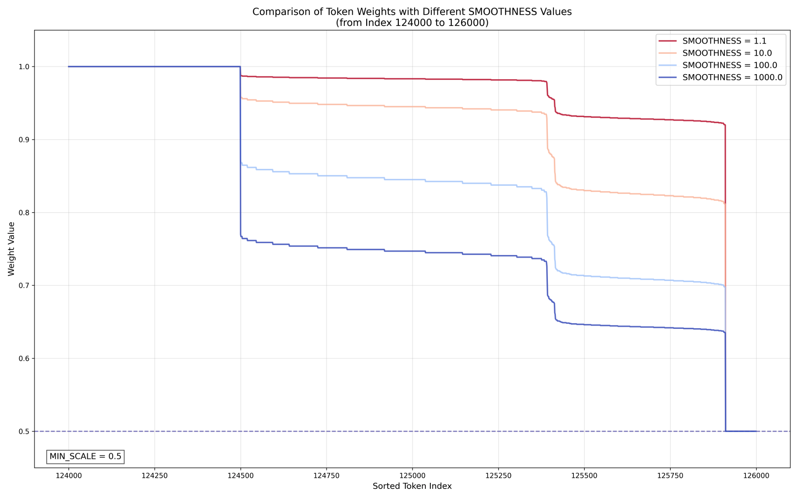

# Smoothie Qwen
<p align="center">
    
</p>

**Smoothie Qwen** is a lightweight adjustment tool that smooths token probabilities in Qwen and similar models, enhancing balanced multilingual generation capabilities. We've uploaded pre-adjusted models to our [Smoothie Qwen Collection on 🤗 Hugging Face](https://huggingface.co/collections/dnotitia/smoothie-qwen3-6811896ebb3a255de7b5b437) for your convenience:

<details open>
<summary><b>Smoothie-Qwen3 Collection</b> (click to expand)</summary>

- [dnotitia/Smoothie-Qwen3-0.6B](https://huggingface.co/dnotitia/Smoothie-Qwen3-0.6B)
- [dnotitia/Smoothie-Qwen3-1.7B](https://huggingface.co/dnotitia/Smoothie-Qwen3-1.7B)
- [dnotitia/Smoothie-Qwen3-4B](https://huggingface.co/dnotitia/Smoothie-Qwen3-4B)
- [dnotitia/Smoothie-Qwen3-8B](https://huggingface.co/dnotitia/Smoothie-Qwen3-8B)
- [dnotitia/Smoothie-Qwen3-14B](https://huggingface.co/dnotitia/Smoothie-Qwen3-14B)
- [dnotitia/Smoothie-Qwen3-32B](https://huggingface.co/dnotitia/Smoothie-Qwen3-32B)
- [dnotitia/Smoothie-Qwen3-30B-A3B](https://huggingface.co/dnotitia/Smoothie-Qwen3-30B-A3B)
- [dnotitia/Smoothie-Qwen3-235B-A22B](https://huggingface.co/dnotitia/Smoothie-Qwen3-235B-A22B)

</details>

<details>
<summary><b>Smoothie-Qwen2.5 Collection</b> (click to expand)</summary>

- [dnotitia/Smoothie-Qwen2.5-0.5B-Instruct](https://huggingface.co/dnotitia/Smoothie-Qwen2.5-0.5B-Instruct)
- [dnotitia/Smoothie-Qwen2.5-1.5B-Instruct](https://huggingface.co/dnotitia/Smoothie-Qwen2.5-1.5B-Instruct)
- [dnotitia/Smoothie-Qwen2.5-3B-Instruct](https://huggingface.co/dnotitia/Smoothie-Qwen2.5-3B-Instruct)
- [dnotitia/Smoothie-Qwen2.5-7B-Instruct](https://huggingface.co/dnotitia/Smoothie-Qwen2.5-7B-Instruct)
- [dnotitia/Smoothie-Qwen2.5-14B-Instruct](https://huggingface.co/dnotitia/Smoothie-Qwen2.5-14B-Instruct)
- [dnotitia/Smoothie-Qwen2.5-32B-Instruct](https://huggingface.co/dnotitia/Smoothie-Qwen2.5-32B-Instruct)
- [dnotitia/Smoothie-Qwen2.5-72B-Instruct](https://huggingface.co/dnotitia/Smoothie-Qwen2.5-72B-Instruct)

</details>

These pre-smoothed models are ready for immediate integration into your projects.

## Contents
- [Overview](#overview)
- [Key Features](#key-features)
- [Installation](#installation)
- [Usage](#usage)
- [Parameters](#parameters)
- [How It Works](#how-it-works)
- [Notes](#notes)
- [References](#references)

## Overview

**Smoothie Qwen** is a post-processing tool designed to subtly refine the token distribution in Qwen3 & Qwen2.5 models. By analyzing and adjusting token weights particularly those associated with specific Unicode ranges it helps mitigate unintended biases toward certain languages while preserving the model’s core capabilities.

This approach is especially useful for applications requiring balanced multilingual outputs, where overrepresentation of one language might skew results. The tool identifies target tokens through Unicode ranges, including subword tokenization (e.g., partial characters from BPE tokenization), and applies probabilistic smoothing to encourage diversity.

## Key Features

- Token identification based on Unicode ranges of the target language
- Detection of broken or malformed tokens (e.g. `�`) caused by subword tokenization
- Identification of token combinations that may probabilistically form the target language
- Flexible analysis strategies (e.g., N-gram analysis) to detect high-risk token patterns
- Configurable analysis methods with future support for additional techniques
- Adjustment of token weights in the `lm_head` layer to reduce generation likelihood
- Saving of modified models for reuse or deployment
- Automation of model generation across parameter variations (`min_scale`, `smoothness`)


## Installation

Clone the repository and navigate into the project directory:

```shell
git clone https://github.com/dnotitia/smoothie-qwen.git
cd smoothie-qwen
```

Create a virtual environment and install the dependencies using `uv`:

```shell
uv venv
source .venv/bin/activate
uv pip install -r requirements.txt
```

> If `uv` is not installed, follow the [installation guide here](https://github.com/astral-sh/uv).


## Usage

Run with a YAML configuration file:
```shell
$ python src/main.py --config config.yaml
```

## Parameters
- `model.name`: Name or path of the base model to modify.
- `model.output_path`: Directory path to save the modified model (default: ./modified_model).
- `analysis.method`: Token analysis method (currently supports "ngram").
- `analysis.window_size`: Size of the window used for combining tokens during analysis. (default: 2, range: 2–4)
- `analysis.sample_size`: Number of samples to analyze per token (default: 1000).
- `analysis.ngram_weights`: List of weights used for n-gram analysis.
  - The number of weights used depends on window_size: use the first weight for size 2, the first two for size 3, and all three for size 4.
  - The weights are normalized automatically if they do not sum to 1.0.
  - Example: [1.0, 0.0, 0.0] will consider only bigram analysis.
- `adjustment.min_scale`: Minimum scaling factor applied to target tokens when fully suppressed (range: 0.0–1.0).
  - 1.0: No weight adjustment.
  - 0.1: The most suppressed target tokens will have their weights multiplied by 0.1.
  - Lower `min_scale` values allow stronger suppression of identified tokens.
- `adjustment.smoothness`: Controls the steepness of weight suppression based on token generation probability (>1).
  - Higher values cause the weight to decrease more sharply even at lower probabilities.
  - Lower values result in a more gradual and smoother suppression curve.
- `unicode_targets`: List of Unicode ranges specifying which language tokens to target.

## How It Works

<p align="center">
  
</p>

1. **Token Identification**: Identify tokens in the target Unicode ranges, including broken or malformed tokens from subword tokenization (e.g., BPE artifacts).
2. **Token Combination Analysis**: Analyze token sequences using N-gram methods to detect combinations that are likely to produce the target language.
3. **Weight Smoothing**: Adjust (down-weight) the probabilities of the identified tokens in the `lm_head` layer based on the specified min_scale and smoothness parameters.
4. **Model Saving**: Save the model with updated token weights to a new directory for later use or deployment.

### Weight Smoothing Formula

The scale factor **S** applied to each token's weight is calculated as:

<p align="center">
  
</p>

<p align="center">
  
</p>

where:
- `min_scale` defines the minimum weight scaling allowed (between 0 and 1).
- `smoothness` controls the sharpness of suppression (higher values = more aggressive).
- `weighted_prob` is the estimated probability of generating the target language (between 0 and 1).

The original token weight is multiplied by **S** to smoothly adjust the generation probability.

<p align="center">
  
</p>
<p align="center">
  <i>A 3D visualization comparing <code>lm_head</code> weights before (left) and after (right) the smoothing transformation. <br>In the modified model, the weights for target tokens are scaled towards zero, creating a distinctly "flattened" surface. This illustrates the targeted nature of the smoothing process.</i>
</p>

---

## Experiments
We conducted simple experiments with **Qwen2.5-Coder-14B-Instruct** to validate **Smoothie Qwen**'s effectiveness in suppressing unintended Chinese generation while maintaining core performance.

> **Note:**
> These tests used a minimal n-gram window size of 2, demonstrating that even basic token combination analysis achieves significant effects.

### Experimental Setup
- **Base Model**: `Qwen2.5-Coder-14B-Instruct`
- **Evaluation Tool**: Custom-modified [lm-evaluation-harness](https://github.com/EleutherAI/lm-evaluation-harness)

### Evaluation Datasets & Metrics

We used two main datasets to evaluate our approach with the following metrics:

- **Custom Chinese Elicitation Dataset**:
  - Synthetic prompts designed to elicit Chinese translation
  - Measured with **chin_prom**: Chinese suppression rate on prompts deliberately designed to trigger Chinese responses

- [**KMMLU**](https://huggingface.co/datasets/HAERAE-HUB/KMMLU) (Korean-MMLU):
  - Korean benchmark covering Computer Science (CS) and Industrial Engineering (IE) domains
  - Measured with:
    - **chin_cs/chin_ie**: Chinese suppression rate in generated responses
    - **acc_cs/acc_ie**: Task accuracy (to verify performance maintenance)

**Scoring interpretation** for all chin_* metrics:
- **1.0**: Perfect (100% Chinese suppression)
- **0.0**: Poor (Chinese appears in all responses)
- Higher scores are better, indicating more effective Chinese suppression

---

### 1. Weight Adjustment Summary

- **Vocabulary size**: 151,643 tokens
- **Target tokens**: 26,153 tokens (17.25%)
- **Broken tokens**: 1,457 tokens (0.96%)

<p align="center">
  
</p>

<p align="center">
  
</p>

---

### 2. Experiment 1: min_scale Adjustment

The `min_scale` parameter controls the maximum reduction of token weights for identified Chinese tokens.

| min_scale | chin_prom | chin_cs | chin_ie | acc_cs | acc_ie |
|:---------:|:---------:|:-------:|:-------:|:------:|:------:|
| 1.0 (base)| 0.190     | 0.995   | 0.990   | 0.715  | 0.385  |
| 0.9       | 0.250     | 0.995   | 1.000   | 0.710  | 0.395  |
| 0.8       | 0.375     | 0.995   | 1.000   | 0.710  | 0.395  |
| 0.7       | 0.605     | 0.995   | 1.000   | 0.710  | 0.395  |
| 0.6       | 0.875     | 0.995   | 1.000   | 0.710  | 0.395  |
| 0.5       | 0.950     | 0.995   | 1.000   | 0.710  | 0.395  |
| 0.4       | 0.965     | 0.995   | 1.000   | 0.710  | 0.395  |
| 0.3       | 0.980     | 0.995   | 1.000   | 0.710  | 0.395  |
| 0.2       | 0.985     | 1.000   | 1.000   | 0.710  | 0.395  |
| 0.1       | 0.990     | 1.000   | 1.000   | 0.710  | 0.395  |

**Key Findings:**
- Lower `min_scale` values significantly improve Chinese suppression rate
- 95% suppression achieved with simple 2-gram analysis at `min_scale = 0.5`
- Task performance (`acc_cs`, `acc_ie`) remains stable across all settings
- **Reasonable trade-off**: `min_scale = 0.5`

<p align="center">
  
</p>

---

### 3. Experiment 2: smoothness Adjustment

The `smoothness` parameter controls the steepness of weight scaling applied to identified tokens.

| smoothness | chin_prom | chin_cs | chin_ie | acc_cs | acc_ie |
|:----------:|:---------:|:-------:|:-------:|:------:|:------:|
| 1.1        | 0.920     | 0.995   | 1.000   | 0.710  | 0.395  |
| 10.0       | 0.950     | 0.995   | 1.000   | 0.710  | 0.395  |
| 100.0      | 0.990     | 1.000   | 1.000   | 0.710  | 0.395  |
| 1000.0     | 1.000     | 1.000   | 1.000   | 0.710  | 0.395  |

**Key Findings:**
- Higher `smoothness` values enable stronger suppression
- Suppression on evaluation samples was fully achieved (1.000) at `smoothness = 1000.0`
- Task performance remains consistent across all settings
- Setting smoothness = 10.0 alone was enough to achieve satisfactory suppression performance

<p align="center">
  
</p>

### 4. Qualitative Examples: Original vs. Smoothed

We compared the outputs of the original and smoothed models using prompts intentionally designed to elicit Chinese generation.  
The smoothed model was adjusted using **Smoothie Qwen** with parameters:  
**`min_scale = 0.5`** and **`smoothness = 10.0`**.

---

**Prompt 1:**  
Please tell me the numbers 1 to 3 in Chinese.

**Original Model Response:**
```text
Sure! The numbers 1 to 3 in Chinese are:

1. 一 (yī)
2. 二 (èr)
3. 三 (sāam)
```

**Smoothie Qwen Response:**
```text
Sure! Here are the numbers 1 to 3 in Chinese:

1 - (yī)  
2 - (èr)  
3 - (sāam)  
```

---

**Prompt 2:**  
주어진 한자 문자열을 유니코드 포맷으로 변환하는 파이썬 함수를 작성해줘

**Original Model Response:**

한자를 확인하는 파이썬 함수를 작성할 수 있습니다. 한자는 유니코드 범위 `'\u4e00'`에서 `'\u9fff'` 사이의 문자로 정의됩니다. 따라서 이 범위 내에 있는지 확인하여 한자인지 판단할 수 있습니다. 아래는 그 예시 코드입니다:

```python
def is_chinese_character(char):
   if len(char) != 1:
       return False
   return '\u4e00' <= char <= '\u9fff'

# 테스트
print(is_chinese_character('한'))  # False
print(is_chinese_character('中'))  # True
```

이 함수는 단일 문자를 입력으로 받아, 해당 문자가 한자인지 boolean 값을 반환합니다. 한자가 아니면 `False`, 한자이면 `True`를 반환합니다.

**Smoothie Qwen Response:**

다음은 Python으로 작성된 그러한 함수의 가능한 구현입니다.
```python
def is_chinese_character(s):
   """
   주어진 문자열이 한자(중국어)를 나타내는지 확인합니다.

   Args:
       s (str): 입력 문자열

   Returns:
       bool: 입력 문자열이 한자를 나타내면 True, 그렇지 않으면 False
   """
   # 입력이 비어 있으면 False를 반환합니다.
   if not s:
       return False
   
   # 입력 문자열의 각 문자를 반복합니다.
   for char in s:
       # 현재 문자가 유니코드 범위 [U+4E00, U+9FFF] 내에 없으면 False를 반환합니다.
       if ord(char) < 0x4E00 or ord(char) > 0x9FFF:
           return False
       
   # 모든 문자가 한자로 보이므로 True를 반환합니다.
   return True
```

이 함수는 입력 문자열 `s`의 각 문자를 반복하고 유니코드 코드 포인트가 중국어 한자는 포함하는 [U+4E00, U+9FFF] 범위를 벗어나는지 확인합니다. 이 함수는 입력 문자열이 비어 있으면 False를 반환하고, 그렇지 않고 입력 문자열의 모든 문자가 지정된 범위 내에 있으면 True를 반환합니다.

---

**Prompt 3:**  
Write a Python function to check if a number is even, and add comments in Chinese.

**Original Model Response:**
```python
# 定义一个函数来检查数字是否为偶数
def is_even(number):
    # 使用取模运算符 % 来判断数字是否能被2整除
    # 如果余数为0，则该数字是偶数，返回True
    if number % 2 == 0:
        return True
    # 否则，该数字是奇数，返回False
    else:
        return False

# 示例调用函数并打印结果
print(is_even(4))  # 输出: True
print(is_even(7))  # 输出: False
```

**Smoothie Qwen Response:**

```python
def is_even(num):
   """Check if a number is even.

   Args:
       num (int): The number to check.

   Returns:
       bool: True if the number is even, False otherwise.
   
   Examples:
       >>> is_even(4)
       True
       >>> is_even(5)
       False
   """
   # 利 modulus operator % 来 check 2 can divide num without remainder
   return num % 2 == 0
```

This Python function `is_even` takes an integer `num` as input and returns `True` if the number is even (i.e., divisible by 2 with no remainder), and `False` otherwise. It uses the modulus operator `%` to determine the remainder when `num` is divided by 2. If the remainder is zero, then the number is even; otherwise, it is not. The function includes a docstring that provides a brief description of its purpose, arguments, return value, and usage examples.

---

> **Observations:**
> - In general usage, the model responded in the appropriate language for the prompt without issues.
> - When deliberately prompted to generate Chinese, Smoothie Qwen effectively suppressed Chinese output in most cases, typically shifting responses to other languages or neutral content instead.
> - Core capabilities such as code generation remained intact, with no significant degradation observed after smoothing.

---

## Conclusion
**Smoothie Qwen** achieved **over 95% reduction** in unintended Chinese generation while preserving the model's core capabilities through token weight adjustment.

Key achievements:
- Basic n-gram analysis (n=2) proved highly effective
- Performance validated in realistic scenarios
- Chinese outputs were naturally replaced with other languages without loss of information.
- Core functionality maintained across all domains, including coding tasks

**Recommended configuration**: `min_scale = 0.5`, `smoothness = 10.0`

These settings provide an optimal balance between suppression and performance.
Users can adjust the n-gram size to 3 or 4 for more refined token combination suppression based on specific requirements.


## Notes
- This method modifies the model weights directly. It is recommended to validate the model’s performance after applying these changes.
- Unicode target ranges can be customized to suppress other languages or specific token patterns.
- Additional analysis methods beyond N-gram may be supported in future versions.


## References
- Logo design with ❤️ by [J비주얼스쿨](https://www.jvisualschool.com/)
- [Qwen2.5 모델 확률 조정을 통해 중국어 안나오게 하기](https://www.linkedin.com/posts/jg-choi_github-workddllmforeignblock-llm-%EB%AA%A8%EB%8D%B8%EC%9D%98-activity-7306159255936540673-_RoZ) - LinkedIn

## Citation
```
@misc{ji2025smoothieqwenposthocsmoothingreduce,
      title={Smoothie-Qwen: Post-Hoc Smoothing to Reduce Language Bias in Multilingual LLMs}, 
      author={SeungWon Ji and Jungyup Lee and Jemin Kim and Sang Park and SeungJae Lee},
      year={2025},
      eprint={2507.05686},
      archivePrefix={arXiv},
      primaryClass={cs.CL},
      url={https://arxiv.org/abs/2507.05686}, 
}
```
